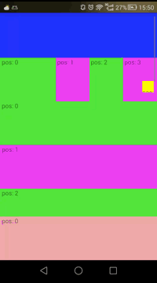

# Tangram for Android

[English Document](README.md)

Tangram是一个以卡片+组件灵活组合为基础的动态化框架，它基于```RecyclerView```搭建页面，在页面结构化和变更频繁的情况下，能灵活展现界面并根据数据动态调整页面。

# 特点

- Android iOS 双平台支持，iOS 版本参考开源库 [Tangram-iOS](https://github.com/alibaba/Tangram-iOS)。
- 通过 json 创建页面视图，并提供了默认的解析器。
- 可轻松实现页面视图的回收与复用。
- 框架提供多种默认的布局方式。
- 通过 json 数据或代码支持自定义布局样式。
- 高性能，基于[vlayout](https://github.com/alibaba/vlayout)
- 支持扩展功能模块

# 示例



# 基本概念
+ 卡片：同一区块的组件集合，负责对组件进行布局。
+ 组件：最小业务单元，好比 RecyclelrView 的 Item。

# 默认卡片

* 通用流式布局卡片（网格）
* 线性布局卡片
* 固定位置布局卡片
* 滑动固定布局卡片
* 滑动吸顶/吸底布局卡片
* 一拖N布局卡片
* 轮播布局卡片
* 瀑布流布局卡片
* 悬浮拖动布局卡片

# 接入教程
详情见[上手教程](docs/TUTORIAL-ch.md)。

# Tangram 文档

详细的介绍文档参考[这里](http://tangram.pingguohe.net/)。

# 贡献代码

在提 Issue 或者 PR 之前，建议先阅读[Contributing Guide](CONTRIBUTING.md)。按照规范提建议。

# 开源许可证
Tangram 遵循MIT开源许可证协议。